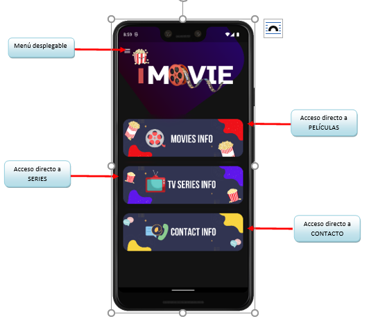
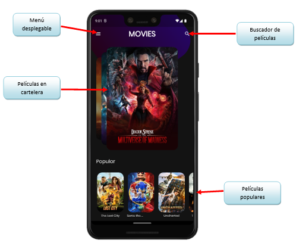
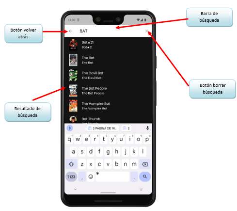
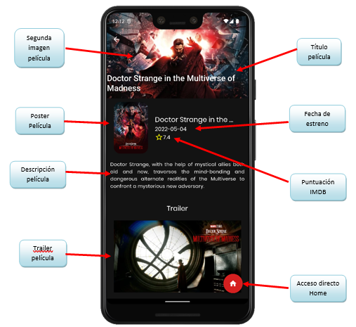
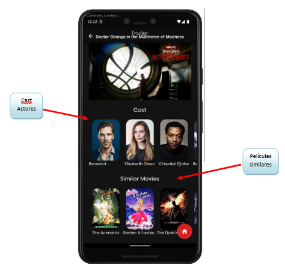
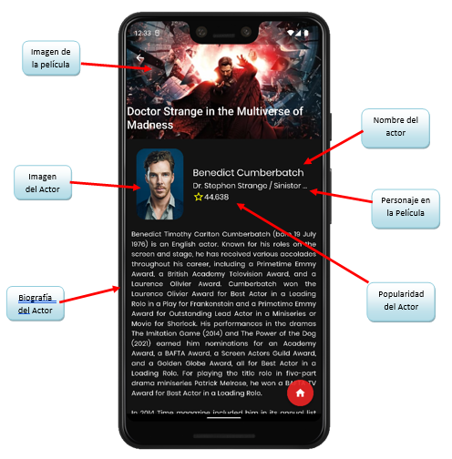
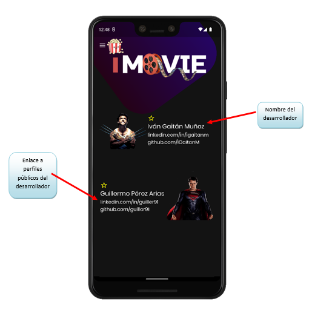

# iMovie

Proyecto creado por dos desarrolladores junior, con la intención de aprender una tecnología que ven apasionante como es Flutter.

## OBJETO

El siguiente manual se elabora con el fin de poder brindar al usuario final un manejo y conocimiento adecuado de la aplicación, facilitando la navegación dentro de sus Funciones con pantallazos intuitivos para una mejor comprensión

## DESCRIPCIÓN DE LA APLICACIÓN

iMOVIE es una aplicación de entretenimiento que ofrece información sobre películas, series de televisión y actores de forma rápida e intuitiva con conexión a una gran base de datos en internet. Toda la información que ofrece está actualizada.

A través de la aplicación se podrán consultar las películas actuales en cartelera, películas populares, buscar película por título , obtener información sobre puntuación, título, trailer, actores en la película, personaje que interpreta el actor, películas similares, información biográfica de los actores, filmografía del actor…etc.

También dispone de una página de contacto con accesos directos a páginas externas personales de los desarrolladores, para resolución de cualquier tipo de incidencia con la aplicación o para resolver dudas sobre programación, lenguajes y herramientas utilizados, etc.

## ICONO DE LA APLICACIÓN

Tras instalar la aplicación aparecerá un icono similar a la imagen siguiente en el menú de aplicaciones de nuestro dispositivo.

**iMovie**

## PÁGINA DE INICIO

## MENÚ DESPLEGABLE

En las pantallas dónde esté disponible este botón, pulsar sobre el símbolo de Menú dará acceso directo a las páginas principales de la aplicación como se muestra en la siguiente imagen:

## PÁGINA DE INFÓRMACIÓN DE PELÍCULAS

Esta página contiene información sobre películas en cartelera y películas populares en la actualidad.

Podemos desplazarnos por el carrusel y al pulsar en cualquiera de ellas se nos abrirá el detalle con información de la película.

## BUSCADOR DE PELÍCULAS

El buscador se utiliza para buscar películas por título. Es predictivo, va dando resultado según se va escribiendo. Al pulsar en cualquiera de los resultados abrirá la página con el detalle de la película.

## PÁGINA DE DETALLE DE PELÍCULA.

Esta página muestra  información de la película seleccionada. En la siguiente imagen se muestra la primera parte del detalle de la película:

La siguiente imagen muestra la 2ª parte del detalle de la película al hacer scroll:

**Las películas similares** es un carrusel que ofrece películas similares a la película actual. Al pulsar sobre cualquiera de ellas nos llevaría a su detalle con su información correspondiente.

**El Cast de actores** es un carrusel con los actores que participan en la película actual. Podemos mantener pulsado un actor para obtener información sobre su personaje en la película sin salirnos del detalle de la película, a través de un mensaje flotante. Si pulsamos cualquier actor, la aplicación nos lleva a la página de detalle del actor.

## PÁGINA DE DETALLE DEL ACTOR.

Esta página muestra información del actor/actriz seleccionados. En la siguiente imagen se muestra la primera parte del detalle:

La siguiente imagen muestra la 2ª parte del detalle del actor al hacer scroll:

**La filmografía** son las películas en las que ha participado el actor. Al pulsar sobre cualquiera de ellas nos llevaría a la página de detalle de la película.

## PÁGINA INFORMACIÓN DE SERIES

Esta página contiene información sobre series en cartelera y series populares en la actualidad.

Podemos desplazarnos por el carrusel y al pulsar en cualquiera de ellas se nos abrirá el detalle con información de la película.

BUSCADOR DE SERIES

El buscador se utiliza para buscar series por título. Es predictivo, va dando resultado según se va escribiendo. Al pulsar en cualquiera de los resultados abrirá la página con el detalle de la serie.

## PAGINA DE DETALLE DE SERIE

Esta página muestra  información de la serie seleccionada .

**Las series similares** es un carrusel que ofrece series similares a la serie actual. Al pulsar sobre cualquiera de ellas nos llevaría a su detalle con su información correspondiente.

**El Cast de actores** es un carrusel con los actores que participan en la serie actual. Podemos mantener pulsado un actor para obtener información sobre su personaje en la serie sin salirnos del detalle de la serie, a través de un mensaje flotante. Si pulsamos cualquier actor, la aplicación nos lleva a la página de detalle del actor.

## PÁGINA DE DETALLE DEL ACTOR EN LA SERIE

Esta página muestra información del actor/actriz seleccionados.

**La filmografía** son las series en las que ha participado el actor. Al pulsar sobre cualquiera de ellas nos llevaría a la página de detalle de la serie.

## PÁGINA DE CONTACTO

Esta página contiene accesos directos a páginas externas personales de los desarrolladores, para resolución de cualquier tipo de incidencia con la aplicación o para resolver dudas sobre programación, lenguajes y herramientas utilizados, etc. Al pulsar en cualquiera de los enlaces se abrirá la aplicación o navegador del dispositivo para visualizarla.

